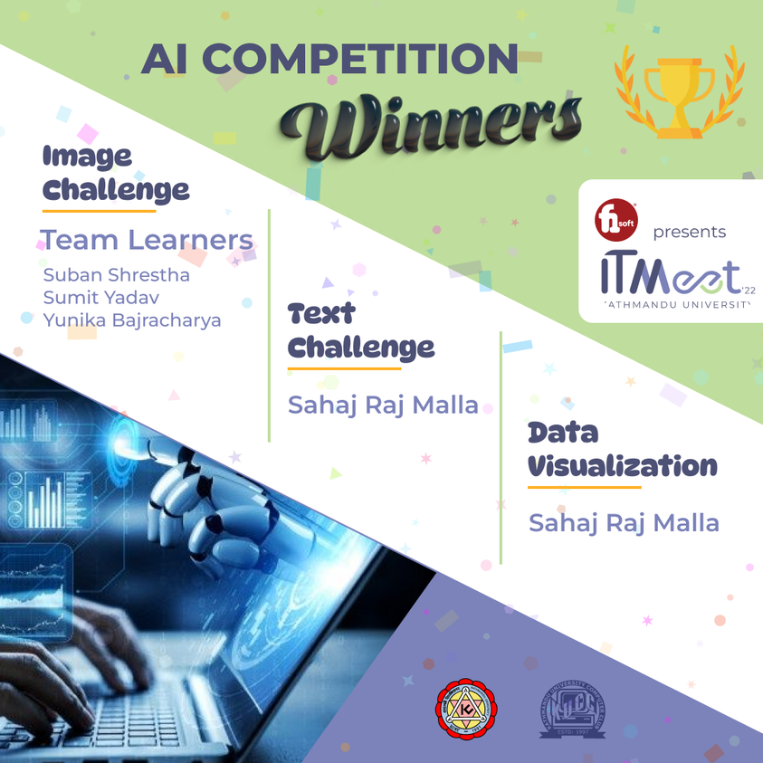
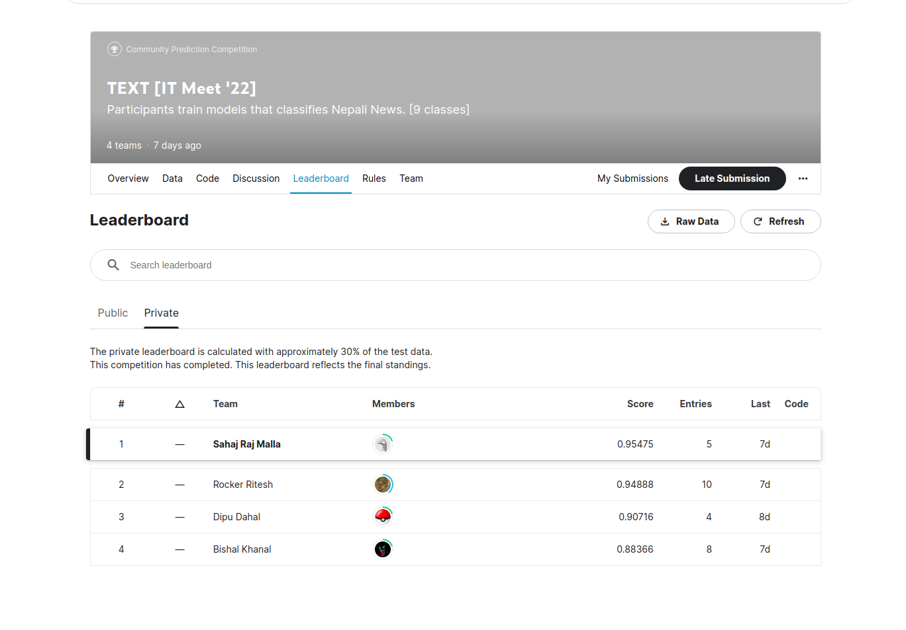

# nepali-news-classification

Developing the DistilBERT model with Sequence Classification on 9 newsgroup datasets for the Nepali language with 95.475% accuracy. It was trained using Transfer Learning on a pretrained model from HuggingFace called [suyogyaart/nepali-newsgroup-classification](https://www.kaggle.com/suyogyaart/nepali-newsgroup-classification).

With the help of this codebase, I managed to win IT MEET 2022's AI Compitetion Text Challenge organized by Kathmandu University and F1Soft.

## Dataset

The entire training and testing dataset can be found [here](https://www.kaggle.com/competitions/text-it-meet-22/data).

